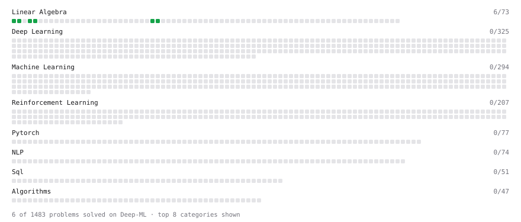

# Deep-ML

My machine learning practice from [Deep-ML](https://www.deep-ml.com). Every solution here was written by hand.

**12** solved · 12 problems · 0 labs · 0 math

[**Browse the interactive portfolio**](https://AIVIETNAM-AIO-Tuan.github.io/deep-ml/) to replay this filling in over time.

## Problems

| | Difficulty | Solved | |
| --- | --- | --- | --- |
| [Calculate Cosine Similarity Between Vectors](https://www.deep-ml.com/problems/76) | easy | 2026-02-14 | [solution](problems/0076-calculate-cosine-similarity-between-vectors) |
| [Calculate Mean by Row or Column](https://www.deep-ml.com/problems/4) | easy | 2026-02-14 | [solution](problems/0004-calculate-mean-by-row-or-column) |
| [Dot Product Calculator](https://www.deep-ml.com/problems/83) | easy | 2026-02-09 | [solution](problems/0083-dot-product-calculator) |
| [Implement ReLU Activation Function](https://www.deep-ml.com/problems/42) | easy | 2026-05-07 | [solution](problems/0042-implement-relu-activation-function) |
| [Implementation of Log Softmax Function](https://www.deep-ml.com/problems/39) | easy | 2026-05-05 | [solution](problems/0039-implementation-of-log-softmax-function) |
| [Linear Regression Using Gradient Descent](https://www.deep-ml.com/problems/15) | easy | 2026-05-09 | [solution](problems/0015-linear-regression-using-gradient-descent) |
| [Matrix-Vector Dot Product](https://www.deep-ml.com/problems/1) | easy | 2026-02-09 | [solution](problems/0001-matrix-vector-dot-product) |
| [Poisson Distribution Probability Calculator](https://www.deep-ml.com/problems/81) | easy | 2026-02-19 | [solution](problems/0081-poisson-distribution-probability-calculator) |
| [Scalar Multiplication of a Matrix](https://www.deep-ml.com/problems/5) | easy | 2026-02-14 | [solution](problems/0005-scalar-multiplication-of-a-matrix) |
| [Sigmoid Activation Function Understanding](https://www.deep-ml.com/problems/22) | easy | 2026-05-07 | [solution](problems/0022-sigmoid-activation-function-understanding) |
| [Softmax Activation Function Implementation ](https://www.deep-ml.com/problems/23) | easy | 2026-05-05 | [solution](problems/0023-softmax-activation-function-implementation) |
| [Transpose of a Matrix](https://www.deep-ml.com/problems/2) | easy | 2026-02-09 | [solution](problems/0002-transpose-of-a-matrix) |

---

_This file is regenerated by Deep-ML on every push._
